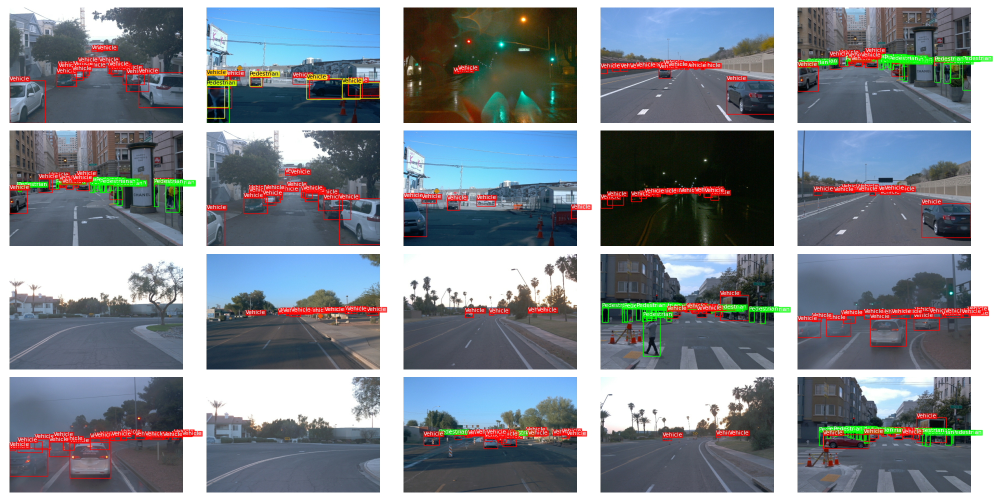
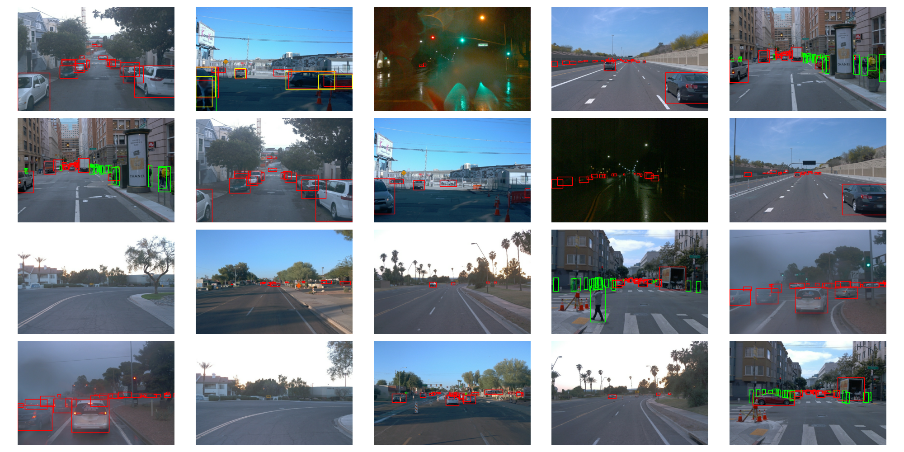

# Visualization Tool Bounding Box

    

This is a visualization script that allows you to create a grid of images with color-coded bounding boxes.

## Requirements

- Python 3.x
- Packages: `matplotlib`, `Pillow`

## Usage

Run the following command to visualize the ground truth data and predictions:

    python visualization.py [--labels]

### Arguments

- `--labels`: Optional. Indicates whether to show labels in the bounding boxes. Valid values are `True` or `False`. By default, labels are shown.

## Examples

Here are two examples of visualization:

### Image with Labels

### Image without Labels

