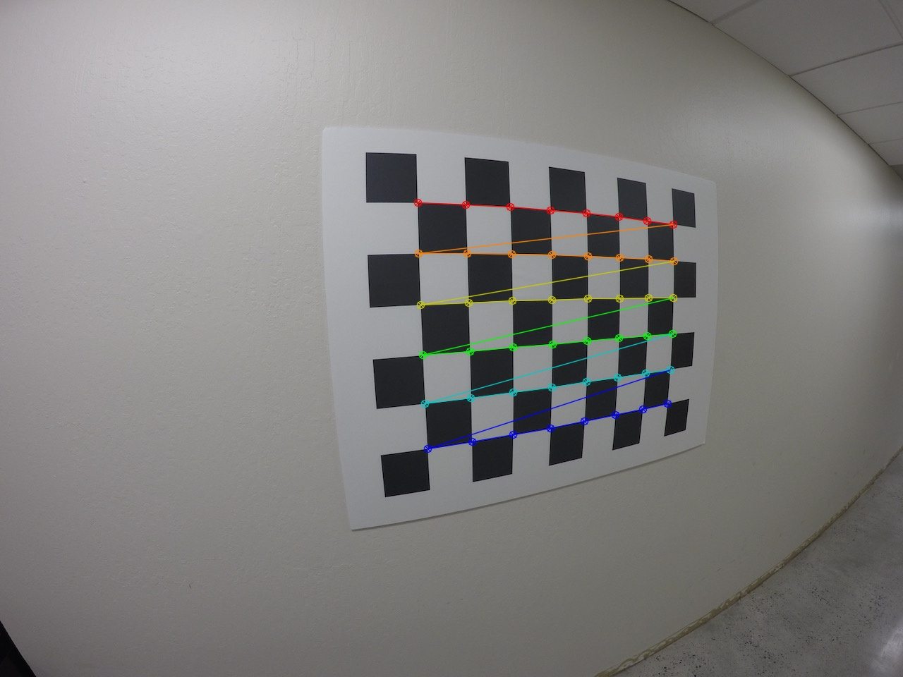
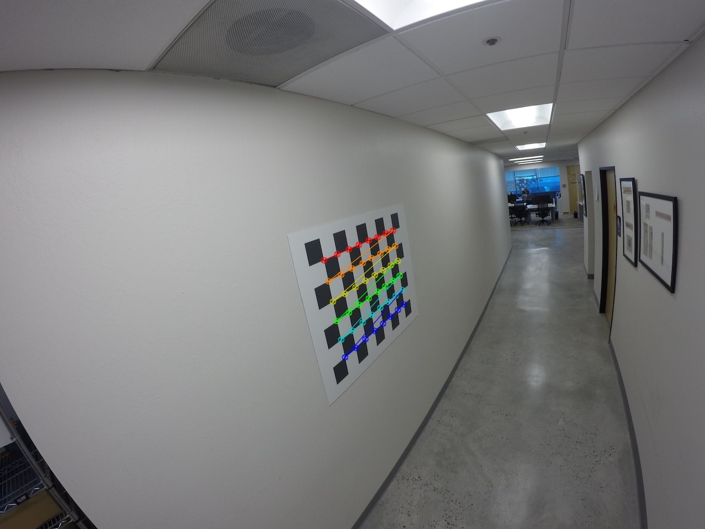
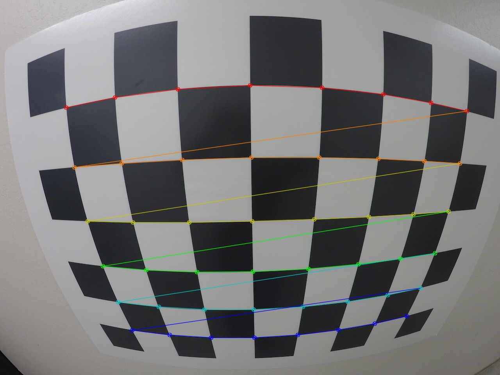

# Camera Calibration

    

This repository provides code examples and instructions for correcting image distortion using camera calibration techniques. The code is implemented in Python using the OpenCV library. 

## Correcting For Distortion

[Distorted and Undistorted Images](orig-and-undist.png)

In this repository, you will find an example of camera calibration and distortion correction. The process consists of two main steps:

1. Obtain image points and object points using chessboard images.
2. Apply the calibration and undistortion using the OpenCV functions `cv2.calibrateCamera()` and `cv2.undistort()`.

Unfortunately, the extraction of object points and image points cannot be performed in the browser quiz editor. However, we provide the necessary files for you to run the code on your own machine.

To get started, follow these steps:

1. Fork the Jupyter notebook and images from [this repository](https://github.com/udacity/CarND-Camera-Calibration).
2. Download the [distortion pickle file](https://s3-us-west-1.amazonaws.com/udacity-selfdrivingcar/files/Advanced_Lane_Finding_Images/correct_for_distortion/wide_dist_pickle.p) and [test image](https://s3-us-west-1.amazonaws.com/udacity-selfdrivingcar/files/Advanced_Lane_Finding_Images/correct_for_distortion/test_image.png) used in the quiz.
3. Run the code using your preferred Python environment.

If you encounter any errors while running the code, please refer to the "Examples of Useful Code" section in the previous video and ensure that your code syntax matches up.

## Additional Information
For more information about camera calibration and distortion correction, refer to the video lectures and course materials provided by Udacity.

Feel free to explore the code and experiment with different images and parameters to further understand the concepts of camera calibration and distortion correction.

Enjoy your journey into the world of image distortion correction!