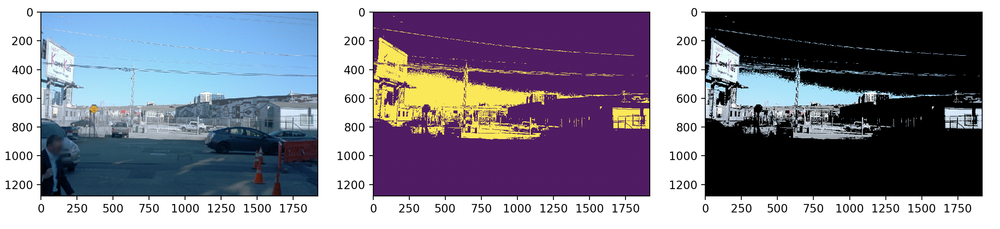

# Image Manipulation

    

This project focuses on two main tasks: masking and statistics analysis of images using the RGB color model.

## Part 1 - Masking

The objective of this task is to create a binary mask of an RGB image based on a color threshold. The mask isolates all the pixels in the image that have RGB values equal to or higher/lower than the specified threshold. The masked image is then generated by applying the mask to the original image.

The implementation consists of two functions:

- **create_mask**: This function takes an input RGB image and a color threshold as arguments and returns a binary mask. The mask is created by comparing the RGB values of each pixel to the color threshold and assigning a value of 0 or 1 to the corresponding mask pixel.
- **mask_and_display**: This function takes the image array and the mask array as arguments and displays the original image, the binary mask, and the masked image side by side.

There is also a second file, masking_bounding_boxes.py, which combines the marking with the objectives of the first part.

To run the code, execute the command python masking.py.

## Part 2 - Statistics

In this task, the goal is to calculate the channel-wise mean and standard deviation of a list of images using the RGB color model. Additionally, the pixel value distributions per channel are visualized using histograms.

The implementation includes two functions:

- **calculate_mean_std**: This function takes a list of image paths as input and calculates the mean and standard deviation of each channel (R, G, B) across all the images. It returns two 1x3 numpy arrays, one for the mean values and one for the standard deviation values.
- **channel_histogram**: This function creates histograms to represent the pixel value distributions per channel. The histograms are encoded with the corresponding color channel.

To run the code and see the results, use the command python statistics.py. Note that the channel_histogram function may take some time to display in the workspace.
## Dependencies

The project requires the following dependencies:

- numpy
- matplotlib
- seaborn
- PIL (Python Imaging Library)
Make sure to install these dependencies before running the code.
## Conclusion

This project provides an opportunity to gain hands-on experience with masking and statistical analysis of images using the RGB color model. By understanding and implementing these tasks, you will enhance your understanding of image processing and data analysis techniques. Feel free to explore and modify the code to further improve your skills in this domain.