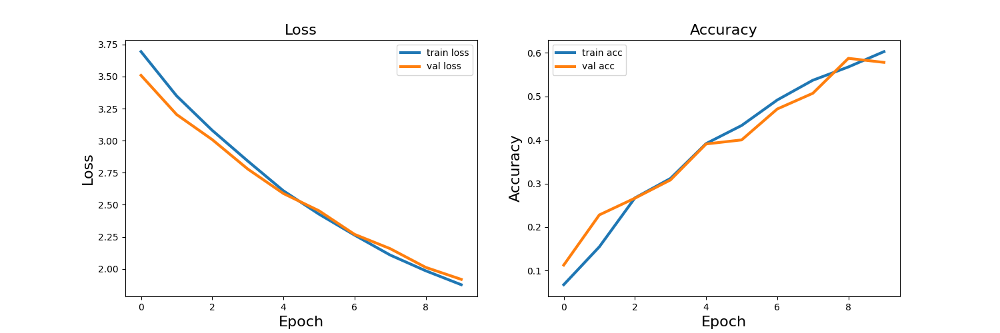

# Image Classification with Feedforward NNs


<div align="center">
    
</div>

This repository contains code for training a deep neural network using TensorFlow and Keras.


## Requirements

Python 3.6 or higher
TensorFlow 2.0 or higher
Matplotlib
## Project Structure

The project consists of two files:

- **utils.py**: Contains utility functions for image processing, displaying metrics, and obtaining datasets.
- **training.py**: Contains the main code for creating and training the neural network.
## Usage

1. Make sure you have the GTSRB image dataset in a directory.
2. Run the training.py file with the following arguments:
- `-d/--imdir`: Path to the data directory.
- `-e/--epochs`: Number of training epochs (optional, default: 10).

```{Python}
python training.py --imdir <path_to_data_directory> --epochs <number_of_epochs>
```
## Results

The code will train a neural network using the provided data and display loss and accuracy plots during training. The results will be saved in an image file `plot_loss_acc_keras.png`.



## Contributions

Contributions are welcome. If you find any bugs or have suggestions for improvement, please open an issue or submit a pull request.
## Conclusion

This project provides an opportunity to gain hands-on experience with masking and statistical analysis of images using the RGB color model. By understanding and implementing these tasks, you will enhance your understanding of image processing and data analysis techniques. Feel free to explore and modify the code to further improve your skills in this domain.